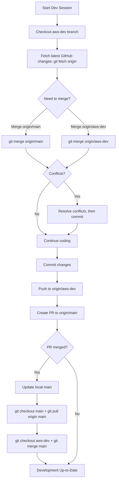

```mermaid
graph TD
    A[Start Dev Session] --> B[Checkout aws-dev branch]
    B --> C[Fetch latest GitHub changes: git fetch origin]
    C --> D{Need to merge?}
    D -->|Merge origin/main| E[git merge origin/main]
    D -->|Merge origin/aws-dev| F[git merge origin/aws-dev]
    E --> G{Conflicts?}
    F --> G
    G -->|Yes| H[Resolve conflicts, then commit]
    G -->|No| I[Continue coding]
    H --> I
    I --> J[Commit changes]
    J --> K[Push to origin/aws-dev]
    K --> L[Create PR to origin/main]
    L --> M{PR merged?}
    M -->|Yes| N[Update local main]
    N --> O[git checkout main + git pull origin main]
    O --> P[git checkout aws-dev + git merge main]
    P --> Q[Development Up-to-Date]
    M -->|No| Q
```